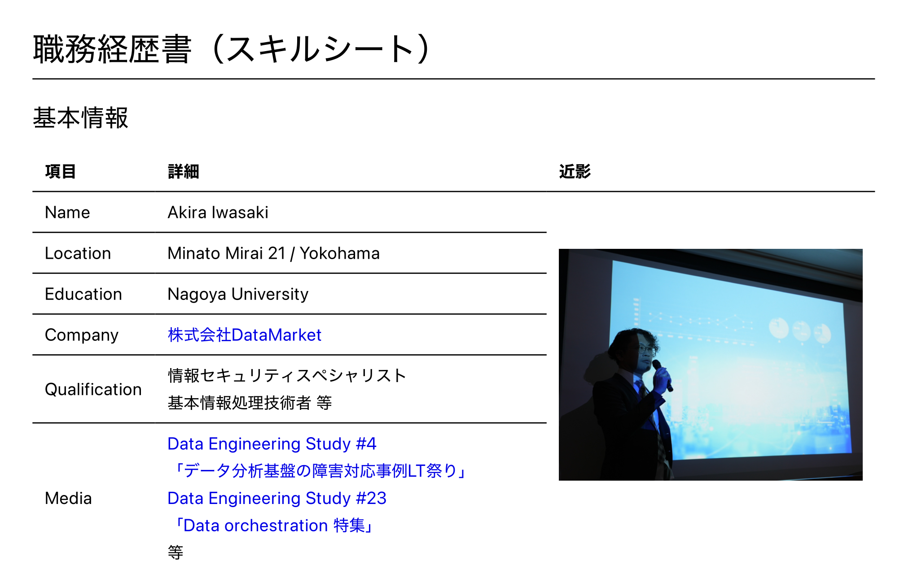

# sista05

### Summary

### sista05's activity🌵

## Profile

**See below for details.** 
[職務経歴書](https://github.com/sista05/Curriculum-Vitae) | [Resume(En)](https://datamarket.co.jp/Resume.pdf)

